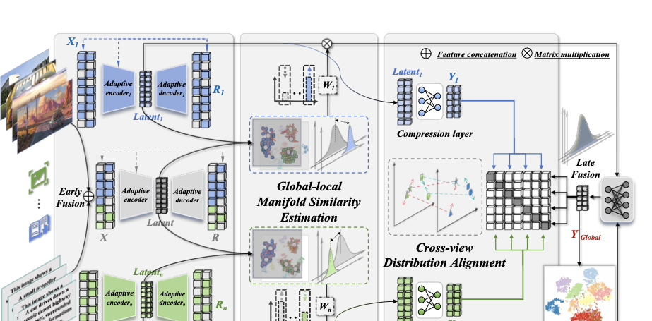

# MASA
## **Towards Robust Multi-View Clustering via Early-to-late Manifold Consistency Calibration** 🚀

<p align="center">
  <a href="https://github.com/cleste-pome">Ruimeng Liu</a><sup>1,2</sup>,
  <a href="https://github.com/changtang">Chang Tang</a><sup>2</sup>,
  <a href="">Bo Wang</a><sup>3</sup>,
  <a href="https://github.com/guanyuezhen">Zhenglai Li</a><sup>4</sup>,
  <a href="">Lianbo Guo</a><sup>2,5</sup>,
  <a href="https://github.com/xinwangliu">Xinwang Liu</a><sup>6</sup>
</p>

<p align="center">
<sup>1</sup>School of Computer Science and Technology, Huazhong University of Science and Technology<br>
<sup>2</sup>School of Software Engineering, Huazhong University of Science and Technology<br>
<sup>3</sup>Institute of Medical Equipment Science and Engineering, Huazhong University of Science and Technology<br>
<sup>4</sup>Shenzhen Institutes of Advanced Technology, Chinese Academy of Sciences<br>
<sup>5</sup>Wuhan National Laboratory for Optoelectronics<br>
<sup>6</sup>School of Computer, National University of Defense Technology
</p>

Welcome to the official implementation of **MASA** — a robust multi-view clustering framework that handles cross-view sparsity heterogeneity via adaptive sparse encoding (AVE), and calibrates view-quality imbalance in late fusion through early-to-late manifold consistency (ELMC).

📣 I also have other multi-view clustering projects that may interest you ✨.

**SparseMVC: Probing Cross-view Sparsity Variations for Multi-view Clustering** [NeurIPS 2025 ✨Spotlight]
- github: https://github.com/cleste-pome/SparseMVC

**Learning Disentangled Representations for Generalized Multi-view Clustering** [TPAMI 2026]
- github: https://github.com/cleste-pome/GMAE

<p align="center">
  
</p>

<p align="center">
The flowchart of our proposed MASA framework. Adaptive View-specific Encoding (AVE) probes the sparsity ratio of each view as prior knowledge for view-aware representation learning and constraint modulation; Early-to-late Manifold Consistency Calibration (ELMC) leverages the stable global manifold preserved in early-fused features to reweight the late-stage fusion of adaptively encoded local features.
</p>

### 📑 Table of Contents
- [🧩 Method Overview: Three Core Modules](#-method-overview-three-core-modules)
- [🔗 Citation](#-citation)
- [📂 Source code list](#-source-code-list)
- [1. 📊 Dataset](#1-dataset)
- [2. ✅ Run](#2-run)
- [3. 🧮 Main Code](#3-main-code)
- [4. 🔬 Loss](#4-loss)
- [7. 💻 User Guide](#7--user-guide-windows--linux--macos)

### 🧩 Method Overview: Three Core Modules

**① AVE — Adaptive View-specific Encoding**
Each view's sparsity ratio $s_v$ is probed from the input (`zero_value_proportion` in `MASA.py`) and used as prior knowledge to adaptively modulate the strength of the entropy-based sparse constraint (adaptive coefficient C_spa in `ae_loss_function`, `loss.py`): sparser views receive stronger sparsity regularization, so that per-view encoders are tuned in a view-aware manner.

**② ELMC — Early-to-late Manifold Consistency Calibration**
The early-fused global manifold is used as a **structural anchor**. For each view, an N×N Gaussian-kernel Laplacian is built (bandwidth σ adaptively set to the global pairwise-distance median), and the consistency score $S_v = \mathrm{Tr}(L_v L_G)$ measures how well the view manifold aligns with the global one. After cross-view normalization, the weights $w_v = S_v / \sum_u S_u$ reweight the late-stage fusion, automatically down-weighting unreliable views. (`GlobalLocalManifoldCalibration.py`; the score form and σ setting are switchable for the ablation study)

**③ GLDA — Global-local Distribution Alignment**
A contrastive loss (τ=1) aligns the global fused representation **H** with each view's shared/common information, while reconstruction and cycle-consistency terms preserve view-specific fidelity; the aligned global representation is finally clustered by K-means into ACC/NMI/PUR/ARI. (`loss.py` + the consistency training stage of `train.py`)

The whole pipeline is trained in **two stages**: AVE pretraining (reconstruction + sparsity) → consistency training (ELMC weighting + GLDA alignment).

### 🔗 Citation
If our paper or code inspires you, please cite this paper when it is available😊:
```
@article{liu2026masa,
  author={Ruimeng, Liu and Chang, Tang and Bo, Wang and Zhenglai, Li and Lianbo, Guo and Xinwang, Liu},
  title={Towards Robust Multi-View Clustering via Early-to-late Manifold Consistency Calibration},
  year={2026}
}
```

### 📂 Source code list:

```shell
MASA
├── train.py                          # 训练主程序（两阶段：AVE 预训练 → 一致性训练）
├── test.py                           # 测试程序（加载 .pth + 数据集 → 前向 → K-means 评估）
├── MASA.py                           # 模型定义（Network：Encoder/Decoder、投影头、循环一致性、加权融合）
├── GlobalLocalManifoldCalibration.py # ELMC 核心（拉普拉斯迹对齐视图权重，σ 自适应，可切换消融配置）
├── loss.py                           # 损失函数（对比损失 + 重建/KL 稀疏）
├── metric.py                         # 评价指标计算（ACC/NMI/PUR/ARI，K-means 评估）
├── main.tex                          # 论文 LaTeX 源文件
├── datasets                          # 数据集存放目录（.mat 格式：X 视图 cell 数组 + Y 标签）
└── utils                             # 辅助功能的工具包
    ├── dataloader.py                 # 数据集加载与预处理（min-max 归一化 + 噪声/冲突/缺失/稀疏注入）
    ├── device_check.py               # 设备前置检查（CUDA > MPS > CPU，MASA_DEVICE 可强制指定）
    ├── Logger.py                     # log 文档打印
    ├── metric2csv.py                 # 指标 CSV 记录
    ├── plot.py                       # 训练曲线与 ELMC σ 变化曲线
    └── tsne_visual.py                # t-SNE 可视化（pdf+svg 双输出）
```

## 1. 📊Dataset
- 数据格式：每个数据集一个 `.mat` 文件放入 `datasets/`，包含 `X`（各视图矩阵的 cell 数组）与 `Y`（样本标签）。
- 训练时 `train.py` 自动遍历 `datasets/` 下全部 `.mat` 数据集。
- 常用多视图数据集可参考：https://github.com/wangsiwei2010/awesome-multi-view-clustering

## 2. ✅Run

(1) To run the **training** (two-stage: AVE pretraining → consistency training), use:

```shell
python train.py
```

- 设备自动选择 **CUDA > MPS > CPU**；可用环境变量 `MASA_DEVICE=cuda|mps|cpu|auto` 强制指定。
- 训练内嵌 K-means 评估，输出目录自动创建：`1.logs/`（日志）、`2.results_imgs/`（曲线）、`3.csv/`（指标）、`4.models/`（.pth 权重）、`5.tsne/`（t-SNE 可视化）、`7.ViewWeights/`（每轮 ELMC 视图权重）。

(2) To run the **evaluation** with a trained model:

```shell
python test.py --model 4.models --datasets MSRCV1
```

也可以直接修改 `test.py` 顶部的 `MODEL_PATH` / `DATASETS` 两个变量后运行，或留空交互输入（权重路径优先级：`--model` > `MODEL_PATH` > 交互输入）。

## 🧮3. Main Code

### 3.1 Configuration

The dataset folder and output directories are handled automatically; the device is selected by `utils/device_check.py`.

```py
# Dataset folder path (all .mat files under it are trained in turn)
folder_path = "datasets"
# Output directories are created at runtime:
# 1.logs/ 2.results_imgs/ 3.csv/ 4.models/ 5.tsne/ 7.ViewWeights/
```

### 3.2 Hyperparameters

```py
# Number of epochs for the AVE pretraining stage
parser.add_argument("--pre_epochs", type=int, default=300)
# Number of epochs for the consistency training stage (ELMC + GLDA)
parser.add_argument("--con_epochs", type=int, default=300)
# Learning rate and weight decay
parser.add_argument("--learning_rate", type=float, default=0.0003)
parser.add_argument("--weight_decay", type=float, default=0.0)
# Feature dimensions (per-view encoder output / high-level common feature)
parser.add_argument("--feature_dim", type=int, default=64)
parser.add_argument("--high_feature_dim", type=int, default=20)
# Random seed and number of runs
parser.add_argument("--seed", type=int, default=50)
parser.add_argument("--iter", type=int, default=1)
```

### 3.3 Dataset Preprocessing (Robustness Perturbations)

```py
# Select samples by noise ratio, then add Gaussian noise to (1..view-1) random views.
parser.add_argument('--noise_ratio', type=float, default=0.0)
# Select samples by conflict ratio, then replace one view's data with the same-view
# data of a sample from another class.
parser.add_argument('--conflict_ratio', type=float, default=0.0)
# Select samples by missing ratio, then set (1..view-1) random views to zero.
parser.add_argument('--missing_ratio', type=float, default=0.0)
# Select dimensions by sparsity ratio, then set random dimensions to zero.
parser.add_argument('--sparsity_ratio', type=float, default=0.0)
```

## 4. 🔬Loss

The overall objective integrates three terms:

```py
# 1. loss_rec：重建损失（MSE），约束每个视图与其全局表示的自编码重建
ae_loss_function(mean_average, xs2one, xr_all, activation[0], rho=0.05, beta=1.0)

# 2. loss_sparse：KL 稀疏约束，稀疏系数 C_spa 由各视图稀疏率自适应调节（AVE）
kl_sparse_loss(hidden_layer_activation, rho, sparse_beta)

# 3. loss_con：对比损失，对齐全局融合特征 H 与各视图公共信息（GLDA）
contrastiveloss(H, rs[v], w2[v])
```

Additionally, the **ELMC** module computes per-view weights by Laplacian trace alignment
`w_v = Tr(L_v · L_G) / Σ_u Tr(L_u · L_G)` with an adaptive bandwidth σ (default: global
pairwise-distance median). The score form and σ setting can be switched at the top of
`GlobalLocalManifoldCalibration.py` (`SCORE_FORM` / `SIGMA_MODE`), corresponding to the
ablation tables in the paper.

## 7. 💻 User Guide (Windows / Linux / macOS)

### Dependencies

```shell
pip install numpy scipy scikit-learn tqdm matplotlib tabulate
```

- Python 3.10+ recommended (developed on 3.12).
- PyTorch is installed separately per platform (see below); the GPU K-means alternatives (cuML/cuPy) are optional and **not** required by default.

### Install PyTorch per platform

| Platform | Install command | Default device |
|---|---|---|
| Linux / Windows + NVIDIA GPU | `pip install torch --index-url https://download.pytorch.org/whl/cu121` | CUDA |
| Linux / Windows (CPU only) | `pip install torch --index-url https://download.pytorch.org/whl/cpu` | CPU |
| macOS Apple Silicon | `pip install torch` (official wheels include MPS support) | MPS |
| macOS Intel | `pip install torch` | CPU |

### Device selection (automatic, no configuration needed)

- Decision rule: **CUDA > MPS > CPU**（`utils/device_check.py`，训练启动时自动探测）。
- Force a device with the environment variable `MASA_DEVICE=cuda|mps|cpu|auto` (unavailable or invalid values fall back to automatic):

```shell
MASA_DEVICE=cuda python train.py    # force CUDA (Linux / Windows)
MASA_DEVICE=mps  python train.py    # force MPS (macOS)
MASA_DEVICE=cpu  python train.py    # force CPU
```

- Standalone probe (prints the environment summary only, no training): `python utils/device_check.py`

### Platform notes

- **macOS**: MPS requires macOS ≥ 12.3 and an official PyTorch build; unsupported ops under MPS (`torch.cdist` / `torch.diag` in the ELMC module) automatically fall back to CPU — nothing to configure.
- **Linux / Windows without CUDA**: falls back to CPU automatically. `OMP_NUM_THREADS=1` is preset in `train.py` to avoid thread oversubscription on CPU.
- **CUDA**: to choose a specific GPU, set `CUDA_VISIBLE_DEVICES` (train.py presets `"0"`); multi-GPU is not required.

### Run

```shell
python train.py                                          # train on all .mat datasets under datasets/
python test.py --model 4.models --datasets MSRCV1        # evaluate a trained model
```
