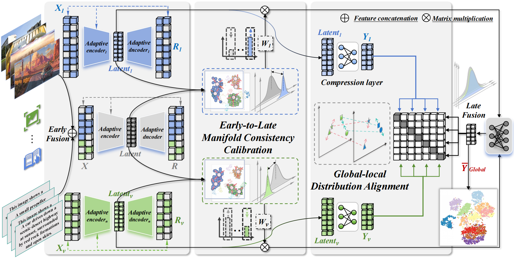
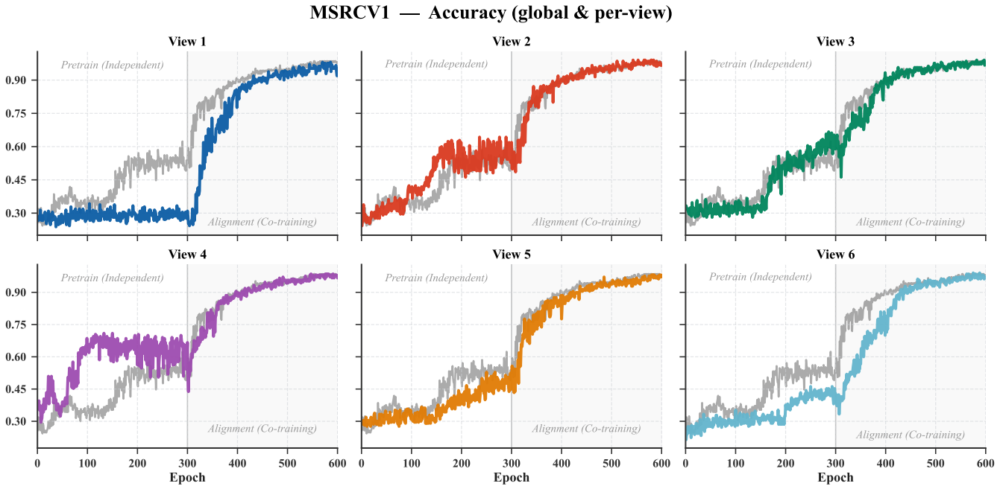

<p align="center">
  <b>English</b> | <a href="README_zh.md">中文</a>
</p>

<div align="center">

<h2>Towards Robust Multi-View Clustering via Early-to-late Manifold Consistency Calibration</h2>

[Ruimeng Liu](https://github.com/cleste-pome)<sup>1</sup>, [Chang Tang](https://github.com/changtang)<sup>1</sup>, [Bo Wang]()<sup>1</sup>, [Zhenglai Li](https://github.com/guanyuezhen)<sup>2</sup>, [Lianbo Guo]()<sup>1</sup>, [Xinwang Liu](https://github.com/xinwangliu)<sup>3</sup>

<sup>1</sup>[Huazhong University of Science and Technology](https://www.hust.edu.cn/), <sup>2</sup>[Shenzhen Institutes of Advanced Technology](https://www.siat.ac.cn/), <sup>3</sup>[National University of Defense Technology](https://www.nudt.edu.cn/)

</div>

***

Welcome to the official implementation of **MASA** — a multi-view clustering framework that handles cross-view sparsity heterogeneity via adaptive view-specific encoding (AVE), and calibrates the late-stage fusion weights through early-to-late manifold consistency (ELMC), which quantifies the agreement between each view's local manifold and the early-fused global manifold.

<details open><summary>📣 I also have other multi-view clustering projects that may interest you ✨.</summary><p>

> [**SparseMVC: Probing Cross-view Sparsity Variations for Multi-view Clustering**](https://openreview.net/pdf?id=cvJvk6oYfC)<br>
> Ruimeng Liu, Xin Zou, Chang Tang, Xiao Zheng, Xingchen Hu, Kun Sun, Xinwang Liu<br>
> [-f9f107.svg)](https://neurips.cc/virtual/2025/loc/san-diego/poster/117045) [](https://github.com/cleste-pome/SparseMVC)

> [**Learning Disentangled Representations for Generalized Multi-view Clustering**](https://doi.org/10.1109/TPAMI.2026.3687339)<br>
> Xin Zou, Ruimeng Liu, Chang Tang, Zhenglai Li, Xinwang Liu, Kunlun He, Wanqing Li<br>
> [](https://doi.org/10.1109/TPAMI.2026.3687339) [](https://github.com/cleste-pome/GMAE)

</p></details>

<p align="center">
  
</p>

<p align="center">
The flowchart of our proposed MASA framework. Adaptive View-specific Encoding (AVE) probes the sparsity ratio of each view as prior knowledge for view-aware representation learning and constraint modulation; Early-to-late Manifold Consistency Calibration (ELMC) leverages the stable global manifold preserved in early-fused features to reweight the late-stage fusion of adaptively encoded local features.
</p>

### 📑 Table of Contents
- [🔗 Citation](#-citation)
- [1. ✅ Run](#1--run)
- [2. 🧮 Main Code](#2--main-code)
- [3. 🔬 Loss](#3--loss)
- [4. 🧩 Method Overview](#4--method-overview)
- [5. 📊 Dataset](#5--dataset)
- [6. 💻 User Guide](#6--user-guide-windows--linux--macos)
- [7. 🙏 Acknowledgments](#7--acknowledgments)

---
### 🔗 Citation
If this work or the code is helpful to you, please cite it when it is available😊:
```
@article{liu2026masa,
  author={Ruimeng, Liu and Chang, Tang and Bo, Wang and Zhenglai, Li and Lianbo, Guo and Xinwang, Liu},
  title={Towards Robust Multi-View Clustering via Early-to-late Manifold Consistency Calibration},
  year={2026}
}
```

---

As a native Chinese speaker, researching means working in a language that is not my own. English never comes easily to me, and my writing still has much to improve. Writing a good paper is also a goal I keep working toward (´･ω･`). This code would not exist without the help I received along the way. I thank the supportive atmosphere of my lab and the generous sharing spirit of the open-source community. I am fortunate to stand on the shoulders of giants. Back then, I kept wishing there was a solid framework I could just pick up, test on, and improve. Now I hope to become one of those who help you, the one who comes after. The method itself may not be anything special. I feel that for a venue like this, finishing the paper is never the end of the work. The follow-up work, such as the open-source framework, deserves just as much care. This repository is my answer to that ( •̀ ω •́ )✧. I want it to be clean, clear, and inspiring to you. If you are working on multi-view clustering or unsupervised representation learning, I hope it saves you some time. Thank you for reading my paper and using my code. It is my honor. If it helps your research even a little, I will be very happy (●'◡'●).

作为一个中文母语者，做研究意味着要用一门不属于自己的语言来工作。英语对我来说从来都不轻松，我的写作也还有很多不足之处需要改进。写一篇好论文，也是我一直在努力的目标 (´･ω･`)。这套代码能够完成，离不开一路上大家给予我的帮助，这要感谢实验室里互相帮助的氛围，感谢开源社区慷慨分享的氛围，我有幸站在了巨人的肩膀上。当时我就一直想要是有一个好的框架可以直接拿来测试改进就好了，现在我也想能成为其中之一去帮助后来的你。我的方法本身也许并不出色，我觉得对于这么好的期刊来说，写完论文绝不是一件工作的结束，后续工作比如开源框架同样值得用心做好。这个仓库就是我给出的答案 ( •̀ ω •́ )✧我希望它是干净的清晰的、能给你启发的。如果你也在做多视图聚类或者无监督表示学习，希望它能帮你省下一些时间。感谢你阅读我的论文，使用我的代码，这是我的荣幸。哪怕它对你的研究只有一点点帮助，我也会非常开心 (●'◡'●)。

## 1. ✅ Run

(1) To run the **training** (two-stage: AVE pretraining → consistency training), use:

```shell
python train.py
```

- The device is selected automatically (**CUDA > MPS > CPU**); use the environment variable `MASA_DEVICE=cuda|mps|cpu|auto` to force a specific device.
- Training embeds K-means evaluation; output directories are created automatically: `1.logs/` (logs), `2.results_imgs/` (curves), `3.csv/` (metrics + view weights), `4.models/` (.pth weights), `5.tsne/` (t-SNE).
- The terminal output is organized into labeled sections: `[Device]` (probed once at startup), then per dataset `[Data]` (dataset info), `[Hyperparams]` (config, once per round), `[Network]` (module structure with parameter counts and shares), and `[Train]` stage banners.
- Each training stage shows a light-blue progress bar that refreshes in place; below it, every epoch reports the loss with its components (pre: `global_ae + view_ae`; con: `global_ae + view_ae + contrastive`), the probed sparsity ratios, and the ELMC view weights.
- When a round finishes, the best weighted result (`Max metric: epoch...` with ACC/NMI/PUR/ARI) is printed, followed by one-line notices of where the log, curves, and metrics were saved. With `--iter > 1`, a final summary table lists every round's best metrics plus their mean and standard deviation.

(2) To run the **evaluation** with a trained model:

```shell
python test.py --model 4.models --datasets ALOI-100
```

Alternatively, edit the `MODEL_PATH` / `DATASETS` variables at the top of `test.py`, or leave them empty for interactive input (weight-path priority: `--model` > `MODEL_PATH` > interactive input).

### 📂 Source code list:

```shell
MASA
├── train.py                          # Training entry (two-stage: AVE pretrain → consistency training)
├── test.py                           # Evaluation (load .pth + dataset → forward → K-means)
├── MASA.py                           # Model definition (Network: Encoder/Decoder, projection head, weighted fusion)
├── loss.py                           # Loss functions (contrastive + reconstruction/KL sparsity)
├── datasets                          # Dataset directory (.mat: X view-cell array + Y labels)
├── docs                               # Figures used in this README
└── utils                             # Utilities
    ├── count_datasetY.py             # Class distribution statistics & plots
    ├── dataloader.py                 # Data loading & preprocessing (min-max norm + noise/conflict/missing/sparsity injection)
    ├── device_check.py               # Device probing (CUDA > MPS > CPU, MASA_DEVICE override)
    ├── GlobalLocalManifoldCalibration.py # ELMC core (Laplacian trace-alignment view weights, adaptive σ, switchable ablation configs)
    ├── Logger.py                     # Logging
    ├── metric.py                     # Metrics (ACC/NMI/PUR/ARI, K-means evaluation)
    ├── metric2csv.py                 # Metric CSV export
    ├── plot.py                       # Training curves & ELMC σ curve
    ├── scripts.py                    # Shared utilities (seed/timing/formatting, model summary, progress bar format)
    └── tsne_visual.py                # t-SNE visualization (pdf+svg)
```

---

## 2. 🧮 Main Code

### 2.1 Configuration

The dataset folder and output directories are handled automatically; the device is selected by `utils/device_check.py`.

```py
# Dataset folder path (all .mat files under it are trained in turn)
folder_path = "datasets"
# Output directories are created at runtime:
# 1.logs/ 2.results_imgs/ 3.csv/(Metrics, ViewWeights) 4.models/ 5.tsne/
```

### 2.2 Hyperparameters

```py
# Dataset name (defaults to the current .mat file; keep the default, passing it manually desyncs log/model filenames)
parser.add_argument('--dataset', default=Dataname)
# Batch size (the runtime forces the full dataset size; NUSWIDEOBJ keeps 256)
parser.add_argument('--batch_size', default=256, type=int)
# Learning rate
parser.add_argument("--learning_rate", type=float, default=0.0003)
# Number of epochs for the AVE pretraining stage
parser.add_argument("--pre_epochs", type=int, default=300)  # 300
# Number of epochs for the consistency training stage (ELMC + GLDA)
parser.add_argument("--con_epochs", type=int, default=300)  # 300/600
# Feature dimensions: larger for encoding (richer representations), smaller for the contrastive projection (confines the loss to a compact subspace, shielding the encoder from dimensional collapse).
parser.add_argument("--feature_dim", type=int, default=64)       # view-specific features
parser.add_argument("--high_feature_dim", type=int, default=20)  # compressed feature dimension
# Random seed (fixed value for reproducible runs)
parser.add_argument("--seed", type=int, default=42)
# Number of runs; --iter > 1 perturbs the seed/lr deterministically each round
parser.add_argument("--iter", type=int, default=1)
# Weight decay (L2 penalty on the network weights, passed to the Adam optimizer to prevent overfitting; 0.0 disables it)
parser.add_argument("--weight_decay", type=float, default=0.0)
```

### 2.3 Dataset Preprocessing

```py
# Select samples by noise ratio, then add Gaussian noise to (1..view-1) random views.
parser.add_argument('--noise_ratio', type=float, default=0.0)
# Select samples by conflict ratio, then replace one view's data with the same-view data of a sample from another class.
parser.add_argument('--conflict_ratio', type=float, default=0.0)
# Select samples by missing ratio, then set (1..view-1) random views to zero.
parser.add_argument('--missing_ratio', type=float, default=0.0)
# Select dimensions by sparsity ratio, then set random dimensions to zero.
parser.add_argument('--sparsity_ratio', type=float, default=0.0)
```

### 2.4 Outputs

All output directories are created automatically. All files of one dataset run share the same timestamp in their names (`{dataset}_{timestamp}`), so results from the same run are easy to pair.

| Directory | Contents | Naming |
|---|---|---|
| `1.logs/` | Training logs per dataset (also holds the class-distribution report figure) | `{dataset}/{dataset}_{timestamp}_{ratio}.log` |
| `2.results_imgs/` | Training curves (loss / ACC / NMI / PUR / ARI) and the ELMC σ curve | `{dataset}_{timestamp}/{dataset}_ep{epochs}_{name}.png` |
| `3.csv/Metrics/` | Per-epoch metrics: summary and per-view + global | `{dataset}_{timestamp}_{ratio}.csv`, `view_{dataset}_{timestamp}_{ratio}.csv` |
| `3.csv/ViewWeights/` | Per-epoch ELMC view weights | `{dataset}_{timestamp}.csv` |
| `4.models/` | Trained model weights (.pth) | `{dataset}/{dataset}_{timestamp}.pth` |
| `5.tsne/` | t-SNE visualizations of features (PDF + SVG) | `{dataset}_{timestamp}/{epoch}_{dataset}[_EarlyFusion].pdf` |

Where `{dataset}` is the dataset name, `{timestamp}` is the run time (one per dataset, shared by all its outputs), `{ratio}` is the perturbation setting `{noise}_{conflict}_{missing}`, and `{name}` is the metric name (`acc` / `nmi` / `pur` / `ari`).

---

## 3. 🔬 Loss

The overall objective integrates three terms:

```py
# 1. loss_rec: reconstruction (MSE), constraining the autoencoder of each view and the global representation
ae_loss_function(mean_average, xs2one, xr_all, activation[0], rho=0.05, beta=1.0)

# 2. loss_sparse: KL sparsity, coefficient C_spa adaptively modulated by each view's sparsity ratio (AVE)
kl_sparse_loss(hidden_layer_activation, rho, sparse_beta)

# 3. loss_con: contrastive loss aligning the global fused representation H with each view's common information (GLDA)
contrastiveloss(H, rs[v], w2[v])
```

Additionally, the **ELMC** module computes per-view fusion weights by Laplacian trace
alignment with an adaptive bandwidth (default: the global pairwise-distance median). The
score form and bandwidth setting can be switched at the top of
`utils/GlobalLocalManifoldCalibration.py` (`SCORE_FORM` / `SIGMA_MODE`), corresponding to the
ablation tables.

The overall objective combines two terms, balanced by a constraint ratio coefficient: the **AVE loss**, summed over all views, of the reconstruction error plus the adaptive entropy-based sparsity penalty (whose strength is modulated by each view's probed sparsity ratio); and the **GLDA loss**, the contrastive alignment between the global fused representation and each view's common information, averaged over views and samples.

---

## 4. 🧩 Method Overview

As the simplest and most intuitive self-supervised task, clustering offers a direct check on the quality of the extracted and fused features: the cleaner the clusters, the more discriminative the learned representation.

MASA is a robust multi-view clustering framework built on three core modules and trained in **two stages**: first *AVE pretraining* (reconstruction with adaptive sparsity), then *consistency training* (ELMC weighting + GLDA alignment). The aligned global representation is finally clustered by K-means into ACC / NMI / PUR / ARI.

**① AVE — Adaptive View-specific Encoding** handles the cross-view sparsity heterogeneity typical of multi-view data: the sparsity ratio of each view is probed from its input (`zero_value_proportion` in `MASA.py`) and used as prior knowledge to adaptively modulate the strength of the entropy-based sparse constraint — sparser views receive stronger sparse regularization, so that each view's encoder is tuned in a view-aware manner (adaptive sparse coefficient in `ae_loss_function`, `loss.py`).

**② ELMC — Early-to-late Manifold Consistency Calibration** quantifies the geometric agreement between each view and the early-fused global representation: a Gaussian-kernel graph Laplacian per view, with an adaptive bandwidth (median heuristic, re-estimated every epoch), is aligned with the global Laplacian into a consistency score; normalized across views, the scores become fusion weights that let the manifold structure of early fusion guide the late-stage fusion and down-weight unreliable views (`utils/GlobalLocalManifoldCalibration.py`; score form and bandwidth setting are switchable for the ablation study; MPS-unsupported ops fall back to CPU automatically).

<p align="center">
  
</p>

<p align="center">
Clustering accuracy (ACC) on MSRCV1 during training.
</p>

**③ GLDA — Global-local Distribution Alignment** aligns the global fused representation with each view's local shared information: both the fused representation and the per-view common information are L2-normalized before computing pairwise similarities, and a contrastive loss (temperature 1) pulls them together — the normalization keeps the temperature meaningful regardless of feature scales; reconstruction terms preserve view-specific fidelity (`loss.py` + the consistency training stage of `train.py`).

**Evaluation metrics.** The quality of the learned representation is measured by four standard clustering metrics: **ACC** (Accuracy) — the proportion of samples correctly matched to the ground-truth labels after optimal label alignment; **NMI** (Normalized Mutual Information) — the normalized mutual information between the clustering and the ground-truth partition; **PUR** (Purity) — the proportion of samples assigned to their dominant class; and **ARI** (Adjusted Rand Index) — the similarity between two clusterings corrected for chance. They are computed on the K-means clustering (n_init=100) of the final global representation, with higher values indicating better clustering quality.

---

## 5. 📊 Dataset

Multi-view clustering data describes the same set of samples from several complementary views — e.g. different feature extractors, image and text modalities, or gene expression profiles — where each view is one feature matrix. Good multi-view datasets provide views that are informative on their own and complementary to each other.

In this repo, each dataset is a single `.mat` file placed under `datasets/`, containing:
- `X`: a cell array of view matrices — `X{1}, X{2}, ...` are the feature matrices of views 1, 2, ..., each of shape `(num_samples, num_dimensions)`;
- `Y`: a column vector of sample labels, of shape `(num_samples, 1)`.

To use your own data, arrange the views into the cell array `X`, the labels into `Y`, save them into a `.mat` file (e.g. via `scipy.io.savemat`), and drop the file into `datasets/` — `train.py` picks it up automatically and trains on every `.mat` file in the folder. Common public multi-view datasets can be found at: https://github.com/wangsiwei2010/awesome-multi-view-clustering

---

## 6. 💻 User Guide (Windows / Linux / macOS)

### ⚙️ Requirements

| Library | Version | Recommended | Purpose |
|---|---|---|---|
| python | 3.9.25 | 3.9–3.12 | Runtime environment |
| pytorch | 2.7.1+cu128 | 2.7+ (cu121 / cpu / MPS official wheels by platform) | Network construction & two-stage training (AVE pretrain → consistency training) |
| numpy | 2.5.1 | ≥ 1.21 | Numerical computation (data & metrics) |
| scipy | 1.18.0 | ≥ 1.10 | Load .mat datasets |
| scikit-learn | 1.7.2 | ≥ 1.0 | K-means evaluation: ACC / NMI / PUR / ARI |

- PyTorch is installed separately per platform (see below); the GPU K-means alternatives (cuML/cuPy) are optional and **not** required by default.

### Install PyTorch per platform

| Platform | Install command | Default device |
|---|---|---|
| Linux / Windows + NVIDIA GPU | `pip install torch --index-url https://download.pytorch.org/whl/cu121` | CUDA |
| Linux / Windows (CPU only) | `pip install torch --index-url https://download.pytorch.org/whl/cpu` | CPU |
| macOS (Apple Silicon) | `pip install torch` (official wheels include MPS support) | MPS |

> **提示**：官方源在国内下载较慢，一般 Python 包可换用[清华 TUNA 镜像](https://pypi.tuna.tsinghua.edu.cn/simple)，PyTorch 可换用[阿里云镜像](https://mirrors.aliyun.com/pytorch-wheels/cu121)。

### Device selection (automatic, no configuration needed)

- Decision rule: **CUDA > MPS > CPU** (`utils/device_check.py`, probed automatically at startup).
- Force a device with the environment variable `MASA_DEVICE=cuda|mps|cpu|auto` (unavailable or invalid values fall back to automatic):

```shell
MASA_DEVICE=cuda python train.py    # force CUDA (Linux / Windows)
MASA_DEVICE=mps  python train.py    # force MPS (macOS)
MASA_DEVICE=cpu  python train.py    # force CPU
```

- Standalone probe (prints the environment summary only, no training): `python utils/device_check.py`

### Platform notes

- **macOS**: MPS requires macOS ≥ 12.3 and an official PyTorch build; unsupported ops under MPS (`torch.cdist` / `torch.diag` in the ELMC module) automatically fall back to CPU — nothing to configure.
- **Linux / Windows without CUDA**: falls back to CPU automatically. `OMP_NUM_THREADS=1` is preset in `train.py` to avoid thread oversubscription on CPU.
- **CUDA**: to choose a specific GPU, set `CUDA_VISIBLE_DEVICES` (train.py presets `"0"`); multi-GPU is not required.

---

## 7. 🤝 Acknowledgments

Our proposed MASA draws inspiration from the works of [SCMVC](https://github.com/SongwuJob/SCMVC), [RCML](https://github.com/jiajunsi/RCML), [DCG](https://github.com/zhangyuanyang21/2025-AAAI-DCG) and the [Awesome-Deep-Multi-View-Clustering](https://github.com/jinjiaqi1998/Awesome-Deep-Multi-View-Clustering) collection. We would like to thank the authors for their valuable contributions to the multi-view clustering community.
